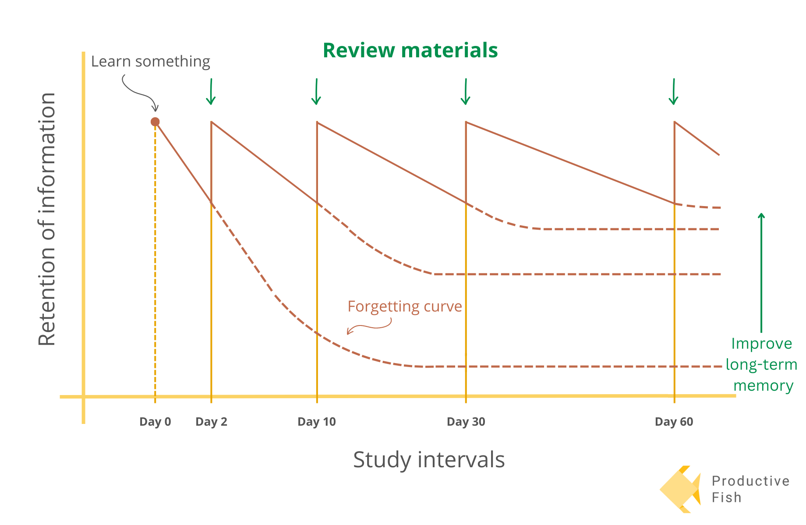
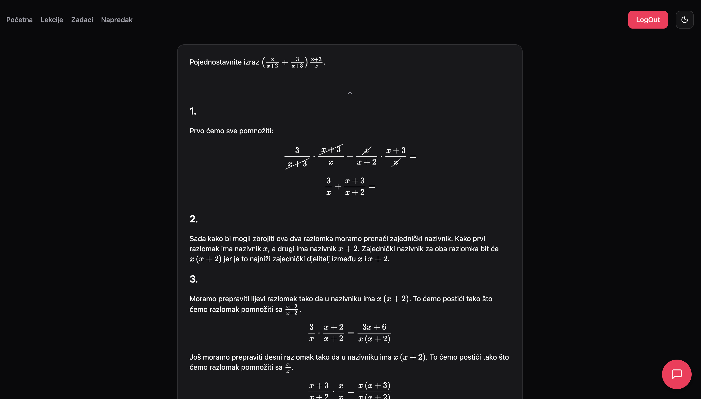

# MatMat

MatMat is an interactive web application designed to help high school students prepare for the Croatian **State Matura Mathematics Exam**. The platform focuses on _learning with understanding_, efficient time usage, and long-term knowledge retention by combining **spaced repetition**, **AI assistance**, and carefully structured math problems.

🌐 **Live website:** [https://matmat.online](https://matmat.online)

---

## ✨ Project Overview

MatMat is not just another practice website or flashcard app. It acts as a **personal math tutor**, guiding students step by step from fundamental concepts to advanced exam-level problems.

The main goal is simple but ambitious: **enable students to reach 100% exam readiness** through smart learning instead of longer studying.

---

## 🚀 Key Features

### 🧠 Spaced Repetition Algorithm

MatMat uses a spaced repetition system that schedules problem reviews based on the student's performance. Tasks are repeated **right before the student is likely to forget them**, maximizing long-term retention and learning efficiency.



---

### ✏️ Step-by-Step Solutions

Every problem includes **detailed, pedagogically designed solutions** that explain _why_ something works, not just the final answer. The focus is on understanding concepts, not memorization.



---

### 🤖 AI Assistant

An integrated AI assistant allows students to:

- Ask questions about a specific problem
- Get additional explanations
- See alternative examples
- Receive hints instead of full answers


---

### 📊 Progress Tracking

On the **Progress** page, students can clearly see:

- Their overall knowledge percentage
- Which chapters are unlocked or locked
- How close they are to full exam readiness

Reaching **100%** means the student has covered all material required for the math matura.


---

### 🧩 Structured Learning Path

Problems are organized so that students naturally progress:

- From basic concepts
- To more complex and exam-level tasks

This ensures a smooth learning curve without overwhelming the student.

---

## 🛠️ Tech Stack

- **Framework:** SvelteKit
- **Language:** JavaScript
- **UI Components:** shadcn/ui
- **Styling:** Tailwind CSS
- **Authentication:** Firebase
- **Frontend Hosting:** AWS Amplify

---

## 🔗 Backend Integration

The MatMat frontend communicates with a custom-built backend via a REST API.

- **API Base URL:** https://api.matmat.online
- **Authentication:** Firebase Authentication (JWT-based)
- **Data Flow:**
  - Fetching math tasks and solutions
  - Submitting task results
  - Progress and statistics tracking
  -

---

## 🔐 Authentication & Security

- User authentication is handled via **Firebase Authentication**
- Access to protected routes and API endpoints requires a valid JWT
- Bot and abuse protection is enforced server-side using **Cloudflare Turnstile**

---

### 1. Clone the repository

```bash
git clone https://github.com/matino06/matmat-frontend.git
cd matmat-frontend
```

### 2. Install dependencies

Make sure you have **Node.js (v18 or newer)** installed.

```bash
npm install
```

### 3. Start the development server

```bash
npm run dev
```

The app will be available at:

```
http://localhost:5173
```

---

## ⚙️ Environment Variables

To run the frontend locally, the following environment variables are required:

```env
GEMINI_API_KEY=
```
